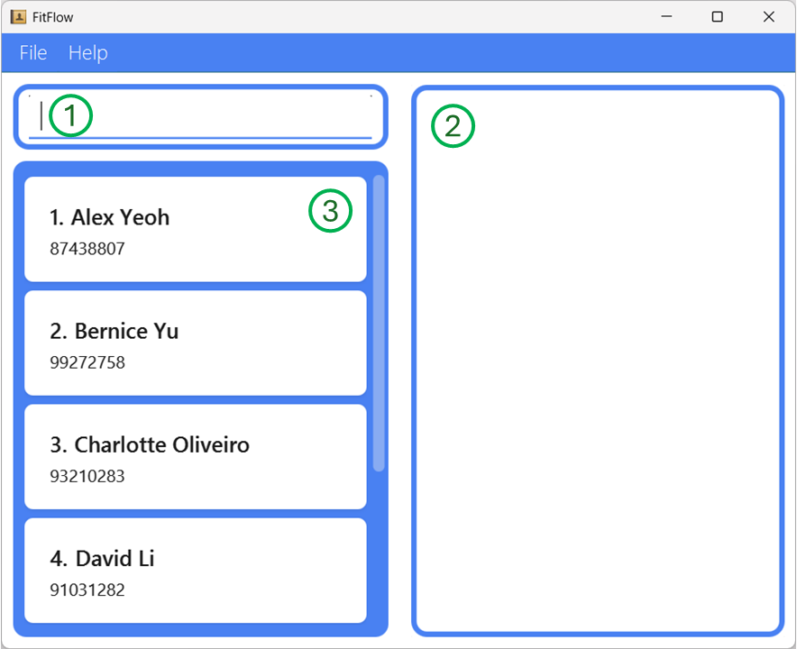
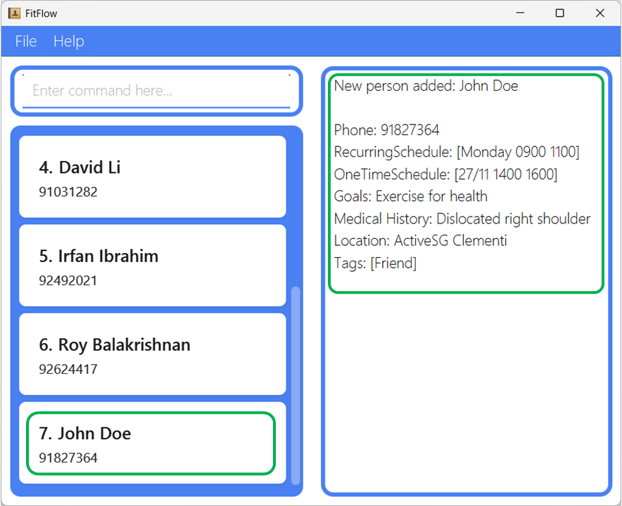
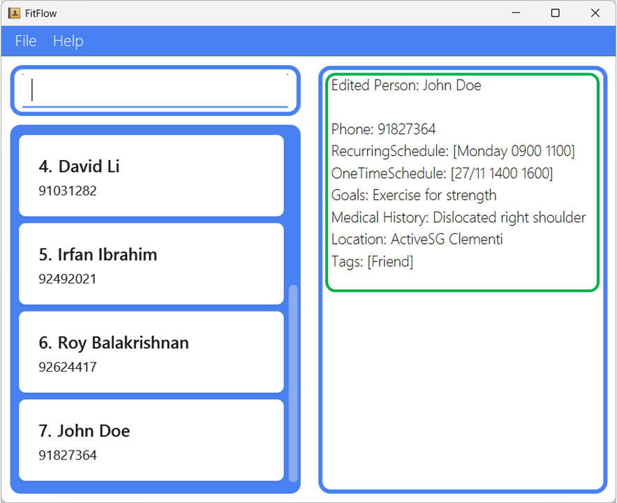

* Table of Contents
{:toc}

--------------------------------------------------------------------------------------------------------------------

## Overview of FitFlow

When you first open the app, this is what you will see. There are **three** key elements in the application.

1. The Textbox. This is where you would be typing all your commands in the application
2. The Output Box. This is where the application will reply to you, based on your commands
3. The Client List. You will be able to view the basic information of the client you have saved.

You will realise that there are some clients already pre-loaded with data. This is done so that you can get a feel for the app. You will be able to remove these entries using the `clear` command later on.

--------------------------------------------------------------------------------------------------------------------

## Getting started

Let's try out some basic commands to get a feel for how the app works!

1. Try typing `find roy` in the Textbox and hit Enter.

    You will see that the Client List now shows you Roy Balakrishnan at index 1. The `find` command is helpful for quickly finding someone in your client list.

2. To see all the clients again, type `list` in the Textbox and hit Enter.

    You can now see all the current clients in the Client List. You can also scroll down on the list to see more clients.

You may have noticed that there are not many details being shown in the Client list. This is to keep the details shown simple and easy on the eyes.

To see the full details of a client, try the following.

3. Type `display 1` in the Textbox and hit Enter.

    You can now see that Alex Yeoh's full details are displayed in the Output Box. You can try `display` with the other indexes currently shown in the client list to see the details of other clients.

:bulb: **Tip:** `display` works with the indexes in the current Client List. This means you can do `find irfan` then `display 1` to quickly see the details of Irfan!

For more information on the commands used in this section, check them out in our User Guide.
* [**`find`**](UserGuide.md#locating-clients-by-name-find)
* [**`list`**](UserGuide.md#listing-all-clients-list)
* [**`display`**](UserGuide.md#displaying-a-clients-details-display)

--------------------------------------------------------------------------------------------------------------------

## Adding, Editing, and Deleting clients in FitFlow

Now that you've gotten the hang of viewing the clients in FitFlow, let's try adding, editing, and deleting!

1. Try typing in the following command and hitting Enter.

    `add n/John Doe p/91827364 rs/Mon 0900 1100 ots/27/11 1400 1600 g/Exercise for health mh/Dislocated right shoulder l/ActiveSG Clementi t/Friend`
    
    You should see a new message in the Output Box, showing the details of the person you added. Notice how John Doe has been given an index of 7, since he was the latest added client.

2. Suppose you keyed in the goals for John Doe wrongly. You can easily update his details using the `edit` command. Try using the following command.

    `edit 7 g/Exercise for strength`
    
    Notice that the goals for John has been updated. If you use the `display` command, you will see this new goal as well.

3. Removing a client from the list is simple. Let's try to remove David Li. To do so, type `delete 4` and hit Enter.

    You will realise that David has been removed from the client list, and the indexes of everyone after has been shifted up by 1. The index of the clients in the list will always be in running order, starting from 1.

For more information on the commands used in this section, check them out in our User Guide.
* [**`add`**](UserGuide.md#adding-a-client-add)
* [**`edit`**](UserGuide.md#editing-a-client--edit)
* [**`delete`**](UserGuide.md#deleting-a-client--delete)

--------------------------------------------------------------------------------------------------------------------

## Viewing schedules

One key feature of FitFlow is the ease in which you can view your schedules for different days. We will use the `view` command to do this.

1. Type in `view Monday` in the Textbox and hit Enter.

    You should see three clients pop up in the Client List, and the Output Box shows their schedules. If you `display` each of these clients, you can see that they indeed have recurring schedules on Monday.

2. Type in `view 25/02` in the Textbox and hit Enter.

    Like before, you will see two client show up, who have a one-time schedule on 25/02

This feature is incredibly convenient in helping you see the schedules you have for the week, and on specific days.

For more information on this command, check out the [**`view`**](UserGuide.md#viewing-schedules-view) section in our User Guide.

--------------------------------------------------------------------------------------------------------------------

## Moving forward...

Now that you've completed the guided tutorial on FitFlow, it's time for you to try it out for yourself.

Type in [**`clear`**](UserGuide.md#clearing-all-entries--clear) in the Text Box and hit Enter. This will clear all the dummy client data from the application.

You can now start to add your own clients and use FitFlow to improve your workflow!

If you would like to see a brief overview of the commands while using the app, type in [**`help`**](UserGuide.md#help--help) and hit Enter. Follow the instructions in the Output Box to find out more about each command.
