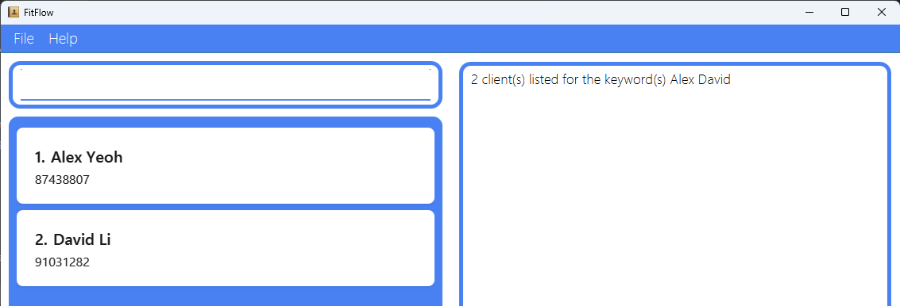

## About FitFlow

FitFlow is a **desktop app for personal trainers in Singapore to manage their clients, optimized for use via a Command Line Interface** (CLI) while still having the benefits of a Graphical User Interface (GUI). If you can type fast, FitFlow can manage your clients faster than traditional GUI apps.

## Using this Guide

The purpose of this user guide is to **help you install FitFlow**, as well as be a **resource you can refer to** if you require any additional help.

You can use the [Table of contents](#table-of-contents) to navigate directly to what you're looking for.

:bulb: **Tips/Info:** 
These boxes contain important/useful information or tips that can help you with using FitFlow.

:exclamation: **Note:** 
These boxes indicate information that you should take note of to avoid running into problems.

:rotating_light: **Caution:** 
These boxes indicate warnings about potential negative outcomes.

## Table of Contents

* Table of Contents
{:toc}

--------------------------------------------------------------------------------------------------------------------

## Quick start

1. Ensure you have Java `17` or above installed in your Computer. 
   **Mac users:** Ensure you have the precise JDK version prescribed [here](https://se-education.org/guides/tutorials/javaInstallationMac.html).

2. Download the latest `.jar` file from [here](https://github.com/AY2425S2-CS2103T-T13-1/tp/releases).

3. Copy the file to the folder you want to use as the _home folder_ for your FitFlow app.

4. Go to your home folder and double-click on the `.jar` file to launch the application. 
    * If the above does not work, try the below steps:
        1. Open a command terminal for your operating system.
            * Windows: Press Windows button + X on the keyboard. Click on Terminal.
            * macOS: Press Command (⌘) + Space on the keyboard and search for "Terminal". Open the Terminal application.
            * Linux: Press Ctrl + Alt + T. The terminal application should open.
        2. Change the directory you are currently in to the home folder, using the command `cd`.
            * A simple way to find the directory is to go to the home folder your normal file browsing app and copying the directory at the address bar. For example, the command could be `cd ~/Downloads/FitFlowFolder`.
        3. Use the `java -jar <FitFlow Filename>.jar` command to run the application.

    A GUI similar to the below should appear in a few seconds. Note how the app contains some sample data. 
    

5. Type the command in the command box and press Enter to execute it. e.g. typing **`help`** and pressing Enter will display the list of available commands in FitFlow. 
   Some example commands you can try:

   * `add n/John Doe p/81234567` : Adds a client named `John Doe` to the FitFlow.

   * `add n/Alice Pauline p/94351253 rs/Mon 1400 1600 ots/1/2 1000 1200 g/Get fitter mh/Twisted right ankle l/Bishan ActiveSG Gym t/friends` : Adds a client named `Alice Pauline` with many details such as her schedule, fitness goal, medical history and location.

   * `find John Doe` : Finds a specific client and displays their name and phone number.

   * `view monday` : Displays the sessions the personal trainer has with the clients on that day.

   * `view 17/2/25` : Displays the sessions the personal trainer has with the clients on that day.

   * `edit 1 p/81234567 rs/Tue 1600 1800 g/Do 10 pull ups` : Edits the details of the 1st client shown in the current list.

   * `delete 3` : Deletes the 3rd client shown in the current list.

   * `help` : Displays the list of available commands the user can use in FitFlow.

   * `help /add` : Displays the format for the specific command in FitFlow.

   * `list` : Lists all clients.

   * `clear` : Deletes all clients.

   * `exit` : Exits the FitFlow app.

6. Refer to the [Features](#features) below for details of each command.

--------------------------------------------------------------------------------------------------------------------

## Guided Tutorial

To get a feel for the app before actually starting to use it, check out our [_Guided Tutorial_](GuidedTutorial.md).

--------------------------------------------------------------------------------------------------------------------

## Features

**:information_source: Tips about the command format:** 

* Words in `UPPER_CASE` are the parameters to be supplied by the user. 
  e.g. in `add n/NAME`, `NAME` is a parameter which can be used as `add n/John Doe`.

* Items in square brackets are optional. 
  e.g. `n/NAME [t/TAG]` can be used as `n/John Doe t/friend` or as `n/John Doe`.

* Items with `…`​ after them can be used multiple times including zero times. 
  e.g. `[t/TAG]…​` can be used as ` ` (i.e. 0 times), `t/friend`, `t/friend t/family` etc.

* Parameters can be in any order. 
  e.g. if the command specifies `n/NAME p/PHONE_NUMBER`, `p/PHONE_NUMBER n/NAME` is also acceptable.

* Extraneous parameters for commands that do not take in parameters (such as `list`, `exit` and `clear`) will be ignored. 
  e.g. if the command specifies `list 123`, it will be interpreted as `list`.

* If you are using a PDF version of this document, be careful when copying and pasting commands that span multiple lines as space characters surrounding line-breaks may be omitted when copied over to the application.

### Help : `help`

Displays the description and formatting of commands in FitFlow.

Format: `help [/COMMAND_NAME]`

* Display all the available commands in FitFlow.
* Displays a specific command and will give the specific description and formatting for that command.

Examples:
* `help` will display the description of all the available commands in FitFlow.
* `help /add` will display the command description and formatting for the add command in FitFlow.

### Adding a client: `add`

Adds a client to FitFlow.

Format: `add n/NAME p/PHONE_NUMBER [rs/RECURRING_SCHEDULE]…​ [ots/ONE_TIME_SCHEDULE]…​ [g/GOALS] [mh/MEDICAL_HISTORY] [l/LOCATION] [t/TAG]…​`

:bulb: **Tip:**
- A client can have any number of recurring schedule, one time schedule, or tags (including 0).

:exclamation: **Note:** 
- A client should have at least have a name and a phone number to be added. 
- Any date provided that excludes year will be treated as a date in the current year. 
- A client with a recurring schedule or one time schedule that conflicts with other clients' sessions will still be added. 
- Use the edit command to rectify any conflicting schedules.

* For `NAME`, `GOALS`, `MEDICAL_HISTORY`, and `LOCATION`, these fields accept all ASCII characters.
* For `PHONE_NUMBER`, any 8-digit number starting with 6, 8, or 9 is accepted.
* For `RECURRING SCHEDULE`, use the format `DAY START_TIME END_TIME`.
  * `DAY` can be any day of the week i.e. `Monday`. You can use 3-letter short-form days as well i.e. `Mon`.
  * `START_TIME` and `END_TIME` should be 4 digits, in 24-hour format.
* For `ONE_TIME_SCHEDULE`, use the format `DATE START_TIME END_TIME`.
  * `DATE` should be in the format `[D]D/[M]M[/YY]`.
    * The day and month of the date can have its leading `0` omitted if it is single digit.
    * The year of the date can be omitted. In this case, the application will assume the current year.
  * `START_TIME` and `END_TIME` should be 4 digits, in 24-hour format.
* To rectify a client's conflicting schedules, refer to the [**`edit`**](#editing-a-client--edit) section.

Examples:
* `add n/Alice Pauline p/94351253 rs/Mon 1400 1600 ots/1/2 1000 1200 g/Get fitter mh/Twisted right ankle l/Bishan ActiveSG Gym t/friends`
* `add n/Betsy Crowe t/friend g/Lose weight l/Jurong GymBox p/91234567 mh/Lower back injury rs/Wed 1500 1700`

### Listing all clients: `list`

Shows a list of all the clients in FitFlow.

Format: `list`

Examples:
* `list` displays and indexes all the clients in FitFlow.

### Locating clients by name: `find`

Find clients whose names contain any of the given keywords.

Format: `find KEYWORD [MORE_KEYWORDS]`

* The search is case-insensitive. e.g. `hans` will match `Hans`.
* The order of the keywords does not matter. i.e. `Hans Bo` will match `Bo Hans`.
* Only the name is searched.
* Only the name and contact number of the client will be displayed. To see a client's full details, refer to the [**`display`**](#displaying-a-clients-details-display) section.
* Only full words will be matched i.e. `Han` will not match `Hans`.
* Clients matching at least one keyword will be returned (i.e. `OR` search).
  i.e. `Hans Bo` will return `Hans Gruber`, `Bo Yang`.

Examples:
* `find John` returns `john` and `John Doe`.
* `find alex david` returns `Alex Yeoh`, `David Li`. 
  

### Displaying a client's details: `display`

Display a client's full details in the client list, identified by the index number used in the displayed client list.

Format: `display INDEX`

* Displays the client at the specified `INDEX`.
* The index refers to the index number shown in the displayed client list.
* The index **must be a positive integer** 1, 2, 3, …​.

Examples:
* `display 1` will display the details of the person at index 1
* `display 5` will display the details of the person at index 5
* `find Betsy` followed by `display 1` displays the details of the 1st client in the results of the `find` command.

### Viewing Schedules: `view`

Displays the sessions the personal trainer has with clients on that day or date.

Format: `view DAY/DATE` 
DAY Format: `Monday` or `Mon` 
DATE Format: `[D]D/[M]M[/YY]`

:exclamation: **Note:** 
- Any date provided that excludes year will be treated as a date in the current year.

* The search is case-insensitive. i.e. `Monday` will match `monday`.
* A day or date field must be provided.
* For `DAY`, 3-letter short-form is allowed, i.e. `Monday` will match with `mon`.
* For `DATE`, the format has to be `[D]D/[M]M[/YY]` e.g. `14/2` matches with `14/02/25` and `7/1/25` matches with `07/01/25`.
  * The day and month of the date can have its leading `0` omitted if it is single digit.
  * The year of the date can be omitted. In this case, the application will assume the current year.

Examples:
* `view Tue` returns the list of clients with sessions on Tuesday.
* `view 25/02/25` returns the list of clients with sessions on 25/02/25.
* `view 21/04` returns the list of clients with sessions on 21/04 in today's year of usage.
* `view Monday` returns the list of clients with sessions on Monday. 
    

### Editing a client : `edit`

Edits an existing client in FitFlow.

Format: `edit INDEX [n/NAME] [p/PHONE_NUMBER] [rs/RECURRING_SCHEDULE]…​ [ots/ONE_TIME_SCHEDULE]…​ [g/GOALS] [mh/MEDICAL_HISTORY] [l/LOCATION] [t/TAG]…​`

:exclamation: **Note:** 
- Any date provided that excludes year will be treated as a date in the current year. 
- A client with a recurring schedule or one time schedule that conflicts with other clients' sessions will still be added. 
- Use the edit command to rectify any conflicting schedules.

* Edits the client at the specified `INDEX`.
* The index refers to the index number shown in the displayed client list.
* The index **must be a positive integer** 1, 2, 3, …​.
* At least one of the optional fields must be provided.
* Existing values will be updated to the input values.
* When editing recurring schedules, one time schedules or tags, the existing parameters of the client will be removed i.e. it is not cumulative.
* You can remove all the client's recurring schedules, one time schedules and tags by typing `rs/`, `ots/`, and `t/` respectively without specifying any value after it.
* For more details on how each field should be formatted, refer to the [**`add`**](#adding-a-client-add) section.

Examples:
*  `edit 1 p/91234567 l/Anytime Fitness ots/4/4 1200 1400` Edits the phone number, location, and one time schedule of the 1st client to be `91234567`, `Anytime Fitness`, and `4/4 1200 1400` respectively.
*  `edit 2 n/Betsy Crower rs/ ots/ t/` Edits the name of the 2nd client to be `Betsy Crower` and clears all existing recurring schedules, one time schedules and tags.

### Deleting a client : `delete`

Deletes the specified client from FitFlow.

Format: `delete INDEX`

:rotating_light: **Caution:** 
**This command is irreversible. Use with caution.**

* Deletes the client at the specified `INDEX`.
* The index refers to the index number shown in the displayed client list.
* The index **must be a positive integer** 1, 2, 3, …​.

Examples:
* `list` followed by `delete 2` deletes the 2nd client from FitFlow.
* `find Betsy` followed by `delete 1` deletes the 1st client in the results of the `find` command.

### Exiting the program : `exit`

Exits the program.

Format: `exit`

### Clearing all entries : `clear`

Clears all entries from FitFlow.

Format: `clear`

:rotating_light: **Caution:** 
**This command is irreversible. Use with caution.**

### Saving the data

FitFlow data are saved in the hard disk automatically after any command that changes the data. There is no need to save manually.

### Editing the data file

FitFlow data are saved automatically as a JSON file `[JAR file location]/data/addressbook.json`. Advanced users are welcome to update data directly by editing that data file.

--------------------------------------------------------------------------------------------------------------------

## FAQ

**Q**: How do I transfer my data to another Computer? 
**A**: Install the app in the other computer and overwrite the sample data file it creates with the file that contains the data of your previous FitFlow home folder.

--------------------------------------------------------------------------------------------------------------------

## Known issues

1. **When using multiple screens**, if you move the application to a secondary screen, and later switch to using only the primary screen, the GUI will open off-screen. The remedy is to delete the `preferences.json` file created by the application before running the application again.
2. **If you minimize the Help Window** and then run the `help` command (or use the `Help` menu, or the keyboard shortcut `F1`) again, the original Help Window will remain minimized, and no new Help Window will appear. The remedy is to manually restore the minimized Help Window.

--------------------------------------------------------------------------------------------------------------------

## Command summary

Action | Format, Examples
--------|------------------
**Help** | `help [/add] [/list] [/edit] [/find] [/display] [/view] [/delete] [/clear] [/exit]`   e.g. `help /add`
**Add** | `add n/NAME p/PHONE_NUMBER [rs/RECURRING_SCHEDULE]…​ [ots/ONE_TIME_SCHEDULE]…​ g/GOALS mh/MEDICAL_HISTORY l/LOCATION [t/TAG]…​`   e.g. `add n/Alice Pauline p/94351253 rs/Mon 1400 1600 ots/1/2 1000 1200 g/Get fitter mh/Twisted right ankle l/Bishan ActiveSG Gym t/friends`
**List** | `list`   e.g. `list`
**Find** | `find KEYWORD [MORE_KEYWORDS]`   e.g. `find John`
**Display** | `display INDEX`  e.g. `display 2`
**View** | `view [DAY] [DAY_SHORT_FORM] [DATE (DD/MM[/YY])]`   e.g. `view Monday`
**Edit** | `edit edit INDEX [n/NAME] [p/PHONE_NUMBER] [rs/RECURRING_SCHEDULE]…​ [ots/ONE_TIME_SCHEDULE]…​ [g/GOALS] [mh/MEDICAL_HISTORY] [l/LOCATION] [t/TAG]…​`  e.g. `edit 1 p/91234567 l/Anytime Fitness ots/4/4 1200 1400`
**Delete** | `delete INDEX`  e.g. `delete 3`
**Exit** | `exit`
**Clear** | `clear`

